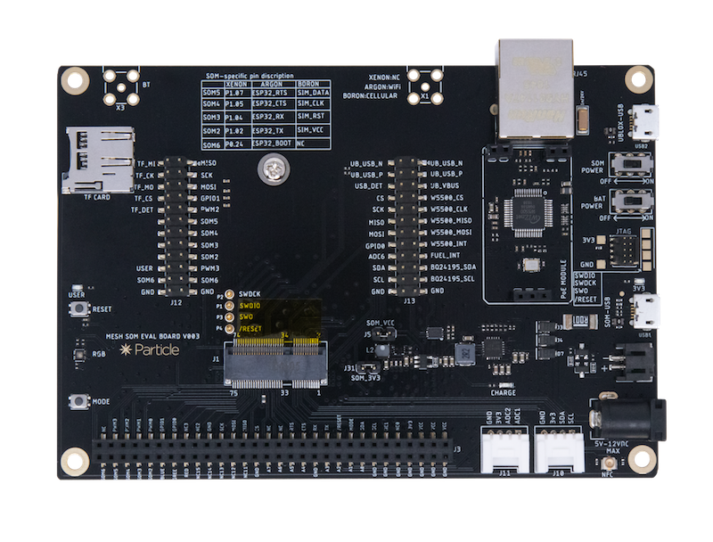

# M.2 SoM Evaluation Board

*Hardware repository for the M.2 SoM evaluation board*

The description of the board and its features can be found in the documentation:

[https://docs.particle.io/datasheets/cellular/b-series-eval-board/](https://docs.particle.io/datasheets/cellular/b-series-eval-board/)

In this repository you can find the following directories:

- eagle: The [Eagle CAD](https://www.autodesk.com/products/eagle/overview) design files for this board. Note that it is a 4-layer board so you won't be able to edit it with the free version.
- gerbers: The Gerber files used to manufacture the board.
- bom: The bill of materials (Excel spreadsheet).

Other useful resources include:

- [Creating your first SoM board tutorial](https://docs.particle.io/tutorials/hardware-projects/som-first-board/).
- [AN001 Basic SoM Design](https://github.com/particle-iot/app-notes/tree/master/AN001-Basic-SoM-Design) is a simple SoM base board. Like a Boron it can be powered by LiPo battery, USB, or an external DC supply. It includes: RGB LED, bq24195 PMIC, MAX17043 Fuel Gauge, USB Connector, LiPo Connector (JST-PH), and M.2 SoM Connector. It is a 2-layer board.

